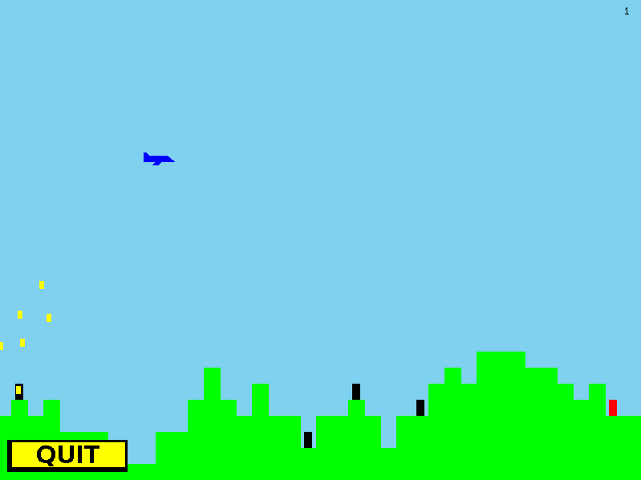

Rainbow Stalin's Wild Ride
==========================

This repository is no longer being maintained.

It's a very simplistic game written under a timeframe for a user interfaces
course at UWaterloo, and its borderline-inappropriate theme is inspired by a
a popular internet meme you can witness [here](http://psapin.github.io/).

I keep this thing around since it holds some personal charm to me. What follows
is the information and instructions I had to hand in when submitting it for the
course.

/------------------------------------\ 
| RAINBOW STALIN'S WILD RIDE         | 
|                                    | 
| Author:     Paul Hendry (pshendry) | 
| Term:       Winter 2013            | 
| Course:     CS 349                 | 
| Assignment: 1                      | 
\------------------------------------/ 
 
 
------------------ 
TABLE OF CONTENTS: 
------------------ 
 
1. How to build and run 
2. How to play 
3. Enhancements 
4. Miscellaneous notes 
 
 
----------------------- 
1. HOW TO BUILD AND RUN 
----------------------- 
 
Run "make" in the main directory of the project, and it will be built (if 
necessary) and run automatically. (Some deprecation warnings will appear, just 
ignore them.) 
 
 
-------------- 
2. HOW TO PLAY 
-------------- 
 
* Click "START" to begin the game.  
* Use the arrow keys to control the plane (the dropping of propaganda papers 
  is done automatically) 
* The goal is to drop a propaganda paper on each of the peasants encountered 
  (shown as black rectangles). Once brainwashed with propaganda, they will 
  change colour to red. 
* The game can be paused by clicking "QUIT" or pressing "f" in-game. This 
  returns you to the main screen, where you may click "RESUME" to continue the 
  game. 
* Score is recorded in the top-right corner of the screen. You obtain +1 score 
  for each peasant brainwashed. 
* The game ends when either an unbrainwashed peasant is missed (they disappear 
  on the left side of the screen) or the plane crashes into the ground. 
* FOR TAs: the "z" and "x" keys can be used to slow down and speed up scrolling 
  speed respectively. If you are having trouble playing the game, just hold 
  down "z" for awhile. 
 
 
--------------- 
3. ENHANCEMENTS 
--------------- 
 
* Resizing: The game is resizeable at all points during its execution: not 
    only the splash screen, but the game and defeat screens also. 
 
* Buttons: Several different buttons appear on various screens, which behave 
    like conventional UI buttons. They appear to visually be pressed down when 
    clicked (this seems not to occur for fast clicks so try holding a click 
    slightly to verify). Additionally, their behaviour is not activated until 
    the click is released, and only if the click is released on top of the 
    button. 
 
* Colour: Many colours are used. 
 
* Projectiles: A high number of projectiles exist simultaneously; additionally, 
    there is a random component to the velocity of each projectile, which can 
    be observed by flying up high. 
 
* Simple controls: The menus can be navigated using only button clicks, and the 
    plane is controlled using only the arrow keys. Sufficient challenge is 
    achieved without requiring an additional "shoot" button. 
 
* Keyboard shortcuts: The first letter of each menu button can also be pressed 
    on the keyboard to activate that button; as such, advanced users can  
    navigate the menus quickly without using the mouse. 
 
* Defeat screen: An additional screen is displayed when the player loses the 
    game. 
 
* Score: The player's score is recorded in the top-right corner of the screen 
    in-game, and final score is displayed on the defeat screen. 
 
* Artwork: Bitmaps are used on menu screens to display more elaborate and 
    appealing visuals (and buttons with text). Bitmaps are not used in-game 
    (except for the quit button for consistency) since they cannot be resized, 
    and I wanted the game screen to be resizeable. 
 
 
---------------------- 
4. Miscellaneous notes 
---------------------- 
 
* With regards to flicker: In testing my game, I encountered no noticeable 
  flicker when running it on my very underpowered laptop. I did notice an 
  occasional flicker when running it in the VM on the same laptop, but I 
  attribute this to the crappiness of my laptop combined with VM-related slowdowns 
  (since just using the VM at all is slow). All this to say that I chose not to 
  double-buffer because I saw no need in my own testing; so if things are a bit 
  flickery when you run it, please don't take off marks! 

